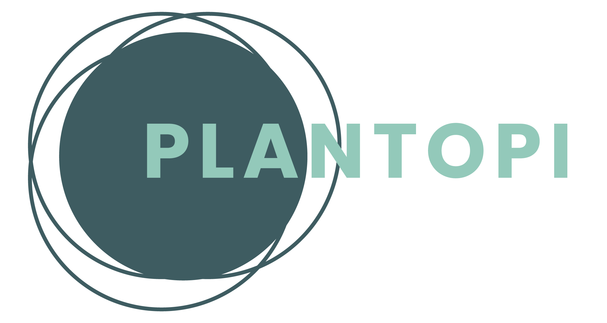

<p align="center"></p>

## About
**Designed to keep your greens alive, you can schedule an automatic irrigation based on your needs, or with the click of a button, no matter where you are**

Plantopi is an irrigation system that allows remote control and monitoring, as well as scheduling for automation. Users can create multiple areas, each with their own set of humidity sensors and controllers (water pumps, electrovalves, lights, etc.), and setup irrigation schedules based on their plants' needs. The application communicates with Arduinos and a Raspberry Pi for IoT control and makes use of Open Weather API for weather data. An overview schema of these various components can be found below.
## Architecture
The diagram below illustrates the app's architecture. The app is engineered to work with many different protocols, including HTTP, WebSockets, and MQTT. Each serves a particular purpose:
1. MQTT is a prevalent messaging protocol in the IoT world because of its lightweight nature. We integrated it to be able to connect the backend server with the microcontrollers on site. MQTT is a pub/sub protocol in which clients can subscribe to topics or publish messages to that topic. If the client is subscribed to a particular topic, it will receive all messages published there and then process them accordingly. The broker serves as a man-in-the-middle and is in charge of relaying the messages to the appropriate clients. Coming back to the app, it was designed to have all microcontrollers subscribed to the "action" topic, where they receive instructions and publish to the status topic, where they send information back to the server. 
2. WebSockets allow for real-time messaging without initiating a request to the server each time information is required. For our case, it is particularly useful to display real-time sensors' readings in the frontend. The app is architected, so every 2 seconds, the sensors send the data, and it is updated in the frontend.
3. The app uses HTTP to send the actions to the server, which are then relayed to the microcontrollers using MQTT. It is also used for all CRUD operations with the database.


## UI


## Requirements

Let's first start with what is required to run the app.

- A **PostgreSQL** server running and with a database already created with the same name as the one you set on **server/ormconfig.json**.
  - An alternative would be to use **docker-compose**, if you have it installed, more instructions below.
- A **MQTT Broker** running. We used a **Raspberry Pi** running **Mosquitto** as the broker. You can follow this link for more info on how to get this setup: (mosquitto-setup)[https://www.instructables.com/Installing-MQTT-BrokerMosquitto-on-Raspberry-Pi/].
- A **NodeMCU** or another **ESP8266** microcontroller.
- A **relay** connected to a water pump or electrovalve.

## Setup

Download the project or clone the repo:

```bash
git clone https://github.com/dev-collectiv/plantopi.git
```

Then enter in the repo's folder:

```bash
cd plantopi
```

Install all the dependencies:

```bash
npm run install:all
```

Now all the dependencies are installed. However, you will also need to create new files where environment variables will be stored.

### Server

On the server-side, you will need two new files:

- **server/.env**

  ```bash
  MQTT_BROKER_IP= "Broker IP"
  MQTT_PORT= "MQTT or mosquito PORT (default 1883)"
  WS_PORT= "Web socekt PORT (default 3002)"
  HTTP_PORT="HTTP or Nest.js Port (default 3001)"
  ```

- **server/ormconfig.json** - contains the variables related to the database, you have to change this file to suit the needs of your PostgreSQL setup, if you don't have PostgreSQL installed, and would rather use Docker, please refere to the next section.

  ```json
  [
   {
     "type": "postgres",
     "host": "localhost",
     "name": "development",
     "port": 5432,
     "username": "postgres",
     "password": "postgres",
     "database": "db",
     "entities": ["dist/**/*.entity.js"],
     "synchronize": true,
     "dropSchema": true
   },
   {
      "type": "postgres",
      "name": "test",
      "host": "localhost",
        "username": "postgres",
      "password": "postgres",
      "database": "testdb",
      "entities": ["dist/**/*.entity.js"],
      "synchronize": true,
     "dropSchema": true
    }
  ]
  ```

- **server/ormconfig.json** - Assuming you already have Docker up and running, there is a script already setup to run the DB along with the whole application. Make sure you are in the root of the app and run `npm run devUnix` which will compose the container with the predefined configs and run the backend along with the frontend.

### Client

On the client-side, you will need one new file:

- **client/.env**

  ```bash
  REACT_APP_SOCKET_HOST="URL base where the socket will send information, we used http://localhost" 
  REACT_APP_SOCKET_PORT=""Socket Port, we used 3002"
  REACT_APP_API_HOST="URL base where  Nest.js  will send information, we used http://localhost" 
  REACT_APP_API_PORT="PORT where react will work, by default its 3001 but it can be changed"
  ```

Now let's run the database:

- If you have **PostgreSQL** installed make sure it's listening on the same host and port that you set in the config file **ormconfig.json** and that a database with the name you set previously is already created.

- If you **don't have** **PostgreSQL**, install docker-compose and run the following command:

  ```bash
  npm run docker
  ```


### IoT

Assuming you have the waterpump/electrovalve connected already to the relay's output and the relay already has an input power source, connect a humidity sensor (optional) to pin **A0**  and the relay to pin **D1**.

On the IoT side you need one new file:

- **IoT/PLANTOPI/config.h**

  ```c++
  //GENERAL SETTINGS
  const int uploadSpeed = 115200; //CHANGE: serial COM speed
  const int digitalOutputPin1 = 5; //CHANGE: pin connected to the relay (D1 pin is the GPIO pin 5)
  
  //WIFI SETTINGS
  const char *wifiSsid = "####"; //CHANGE:
  const char *wifiPassword = "####"; //CHANGE:
  
  //MQTT SETTINGS
  const char *mqttBroker = "####"; //CHANGE: MQTT broker hostname
  const int mqttPort = ####; //CHANGE: MQTT broker port
  const char *mqttControllerId = "pump1";
  const char *mqttControllerInTopic = "action";
  const char *mqttControllerOutTopic = "status";
  const char *mqttControllerResTopic = "response";
  
  unsigned long statusInterval = 2000;
  
  bool sensorActive = true; //CHANGE: set to false if you are not using any sensor
  unsigned long sensorInterval = 1000;
  const char *sensorId = "sensor1";
  const char *mqttSensorTopic = "sensors";
  
  ```

Compile and write file **IoT/PLANTOPI/PLANTOPI.ino** in the NodeMCU.

Make sure the MQTT broker is running.

### Starting the application

Once you have the set up ready, there are different ways to make the software work, but keep in mind, it always will be started from the CLI:

- The shortest way would be by running  the following command to start the client and server simultaneously from the root folder:

  ```bash
  npm run dev
  ```

- Another option is running the server and the client from different its folders.

  - **plantopi/client**

    ```bash
    cd client
    npm start
    ```

  - **plantopi/server**

    ```
    cd server
    npm start  
    ```

## Contributors ✨
[logo]: https://img.shields.io/badge/all_contributors-4-orange.svg 'Number of contributors on All-Contributors'

[![All Contributors][logo]](#link)

Thanks goes to these wonderful people ([emoji key](https://allcontributors.org/docs/en/emoji-key)):

<!-- ALL-CONTRIBUTORS-LIST:START - Do not remove or modify this section -->
<!-- prettier-ignore-start -->
<!-- markdownlint-disable -->
<table>
  <tr>
    <td align="center"><a href="http://cxgarcia.com"><br /><sub><b>Cristobal Schlaubitz Garcia</b></sub></a><br /><a href="#design-CxGarcia" title="Design">🎨</a> <a href="#infra-CxGarcia" title="Infrastructure (Hosting, Build-Tools, etc)">🚇</a> <a href="#ideas-CxGarcia" title="Ideas, Planning, & Feedback">🤔</a> <a href="#projectManagement-CxGarcia" title="Project Management">📆</a> <a href="https://github.com/dev-collectiv/plantopi/commits?author=CxGarcia" title="Code">💻</a></td>
    <td align="center"><a href="https://github.com/hussedev"><br /><sub><b>Hussein  Abdeljabbar Ismail Martínez</b></sub></a><br /><a href="#platform-hussedev" title="Packaging/porting to new platform">📦</a> <a href="#infra-hussedev" title="Infrastructure (Hosting, Build-Tools, etc)">🚇</a> <a href="#ideas-hussedev" title="Ideas, Planning, & Feedback">🤔</a> <a href="#projectManagement-hussedev" title="Project Management">📆</a> <a href="https://github.com/dev-collectiv/plantopi/commits?author=hussedev" title="Code">💻</a></td>
    <td align="center"><a href="http://mertascioglu.ninja"><br /><sub><b>Mert Ascioglu</b></sub></a><br /><a href="#infra-ascolm" title="Infrastructure (Hosting, Build-Tools, etc)">🚇</a> <a href="https://github.com/dev-collectiv/plantopi/commits?author=ascolm" title="Tests">⚠️</a> <a href="#ideas-ascolm" title="Ideas, Planning, & Feedback">🤔</a> <a href="#projectManagement-ascolm" title="Project Management">📆</a> <a href="https://github.com/dev-collectiv/plantopi/commits?author=ascolm" title="Code">💻</a></td>
    <td align="center"><a href="http://www.linkedin.com/in/jose-lamas"><br /><sub><b>jose luis lamas</b></sub></a><br /><a href="#infra-JoseLLamasT" title="Infrastructure (Hosting, Build-Tools, etc)">🚇</a> <a href="#ideas-JoseLLamasT" title="Ideas, Planning, & Feedback">🤔</a> <a href="#projectManagement-JoseLLamasT" title="Project Management">📆</a> <a href="https://github.com/dev-collectiv/plantopi/commits?author=JoseLLamasT" title="Documentation">📖</a> <a href="https://github.com/dev-collectiv/plantopi/commits?author=JoseLLamasT" title="Code">💻</a></td>
  </tr>
</table>

<!-- markdownlint-restore -->
<!-- prettier-ignore-end -->

<!-- ALL-CONTRIBUTORS-LIST:END -->

This project follows the [all-contributors](https://github.com/all-contributors/all-contributors) specification. Contributions of any kind welcome!
